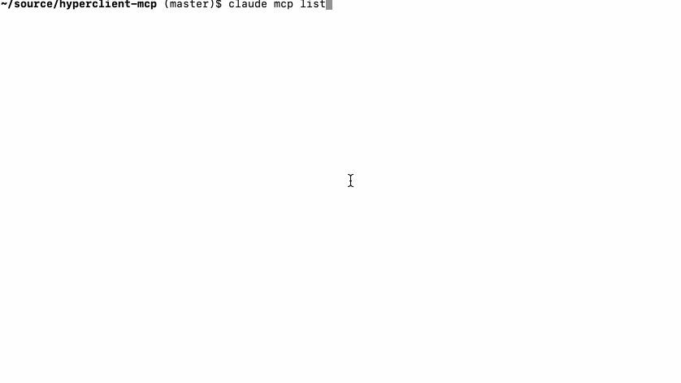

# Hyperclient Mcp

[](https://badge.fury.io/rb/hyperclient-mcp)
[](https://github.com/dblock/hyperclient-mcp/actions/workflows/test.yml)

Turn any hypermedia api into an mcp server.

## Installation

Add to Gemfile.

```
gem 'hyperclient-mcp'
```

Run `bundle install`.

## Usage

### Identify a Hypermedia API

The S'Up service at [sup2.playplay.io](https://sup2.playplay.io) generates fresh triads of team members in Slack to meet for coffee every week in an informal standup. It has a Hypermedia API under [sup2.playplay.io/api](https://sup2.playplay.io/api) that can be enabled with `set api on` and accessed with a token obtained using `set api token`. We'll export TOKEN in a shell for future use.

```bash
export TOKEN=...
```

The Hypermedia client to this api is as follows.

```ruby
api = Hyperclient.new('https://sup2.playplay.io/api') do |client|
  client.headers['X-Access-Token'] = ENV.fetch('TOKEN', nil)
end
```

### Use Hyperclient MCP

#### Command Line

Start the Hyperclient MCP server for any existing API using the convenient command-line proxy.

```bash
hyperclient-mcp --api https://sup2.playplay.io/api --header X-Access-Token=$TOKEN start
```

Register with Claude.

```bash
claude mcp add --transport sse local http://127.0.0.1:9292/mcp/sse
```

Check that it was registered.

```bash
$ claude mcp list
Checking MCP server health...
local: http://127.0.0.1:9292/mcp/sse (SSE) - ✓ Connected
```

Run Claude, try asking a question.

```bash
$ claude "use the local mcp to find the name of the team with ID 64124ac95d758400015faecf"

The team name is dblock.
```

#### Programmatically

To turn any hypermedia API into an MCP in code, create an mcp wrapper and register its `resources` with FastMcp and mount it as usual.

```ruby
hyperclient_mcp = Hyperclient::Mcp::Api.new(api)

mcp_server = FastMcp::Server.new(name: "S'Up", version: '0.0.1')
mcp_server.register_resources(*hyperclient_mcp.resources)

use FastMcp::Transports::RackTransport, mcp_server
```

For example, the MCP code in [examples/sup.playplay.io](examples/sup.playplay.io/) starts an MCP server using code similar to above, and can be directly used with Claude.

```bash
bundle install
bundle exec ruby mcp.rb
```

```bash
claude mcp add --transport sse local http://127.0.0.1:4567/mcp/sse
```



## More Examples

See [examples/grape-with-roar](examples/grape-with-roar/) for a complete example that uses the [grape-with-roar demo project](https://github.com/ruby-grape/grape-with-roar).

## Upgrading

See [UPGRADING](UPGRADING.md).

## Contributing

See [CONTRIBUTING](CONTRIBUTING.md).

## Copyright and License

Copyright (c) 2025, [Daniel Doubrovkine](https://twitter.com/dblockdotorg) and [Contributors](CHANGELOG.md).

This project is licensed under the [MIT License](LICENSE.md).
